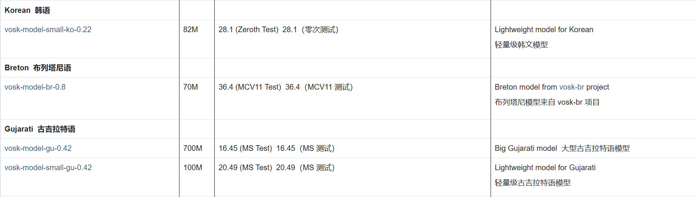

[English](README_en.md) | 简体中文

# 实时字幕翻译

 

一个基于VOSK语音识别和机器翻译的实时字幕翻译工具，支持将音频实时转录为目标语言字幕并进行翻译显示。

## ✨ 特性

- 🎙️ 实时音频转录与翻译
- 🌐 多翻译引擎支持（Google/DeepL/Ollama）
- 📊 主界面显示历史翻译内容

<div align="center">
    
</div>

- 🖥️ 实时字幕框

<div align="center">
    
</div>

- 🎚️ 支持扬声器/麦克风
- 🔧 多语言配置文件支持
- 📚 查阅[VOSK官网](https://alphacephei.com/vosk/models)模型目录确认你需要的语言是否够识别（或者训练你自己的模型）

<div align="center">
    
</div>

## 📥 安装方法

### 方法一：直接使用Release版本

1. 前往 [Releases页面](https://github.com/tuzibr/Real_time_caption_translate/releases/tag/v1.0.0) 下载最新版本压缩包（88MB）
2. 解压到任意目录
3. 双击运行 `Realtimecaptiontranslate.exe`
4. Release版包括一个小型英文识别模型，可直接识别英文并翻译，若要识别其他语言，请从[VOSK官网](https://alphacephei.com/vosk/models)下载对应模型，放在任意文件夹，在设置中设置模型路径即可

### 方法二：从源代码运行

```bash
# 克隆仓库
git clone https://github.com/your-repo/real-time-caption-translation.git
cd real-time-caption-translation

# 安装依赖
pip install -r requirements.txt

# 启动程序
python Run.py
```


## ⚙️ 配置说明

### 翻译引擎配置

| 引擎    | 必需参数         | 注意事项                      |
|---------|------------------|-----------------------------|
| Google  | 无              | 支持100+语言，免费使用       |
| DeepL   | API密钥         | 需注册获取[DeepL密钥](https://www.deepl.com) |
| Ollama  | 本地服务地址     | 需要先安装并启动Ollama服务   |

