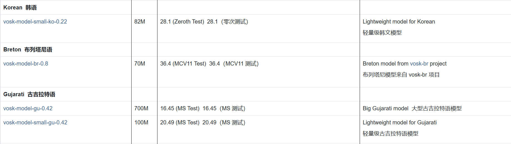

English | [简体中文](README.md)

# Real-time Caption Translate

 

A real-time caption translation tool based on VOSK speech recognition and machine translation, which supports transcribing audio into target language subtitles in real time and displaying the translated content. 

## ✨ Features 
- 🎙️ Real-time audio transcription and translation 
- 🌐 Multi-translation engine support (Google/DeepL/Ollama) 
- 📊 Main interface displays historical translation content 

<div align="center"> 
 
</div> 

- 🖥️ Real-time caption box 

<div align="center"> 
 
</div> 

- 🎚️ Supports speaker/microphone input
- 🔧 Multi-language configuration file support 
- 📚 Check the [VOSK official website](https://alphacephei.com/vosk/models) model directory to confirm if your desired language is supported (or train your own model) 

<div align="center"> 
 
</div> 

## 📥 Installation Methods 

### Method 1: Use the Release Version Directly

1. Go to the [Releases page](https://github.com/tuzibr/Real_time_caption_translate/releases/tag/v1.0.0) and download the latest version of the compressed package (88MB). 
2. Extract it to any directory. 
3. Double-click to run `Realtimecaptiontranslate.exe`. 
4. The release version includes a small English recognition model that can directly recognize and translate English. To recognize other languages, download the corresponding model from the [VOSK official website](https://alphacephei.com/vosk/models), place it in any folder, and set the model path in the settings. 

### Method 2: Run from Source Code 
```bash 
#Clone the repository 
git clone https://github.com/your-repo/real-time-caption-translation.git 
cd real-time-caption-translation 

#Install dependencies 
pip install -r requirements.txt 

#Start the program 
python Run.py 
``` 

## ⚙️ Configuration Instructions 

### Translation Engine Configuration 

| Engine | Required Parameters | Notes | 
|----------|---------------------|------------------------------------| 
| Google | None | Supports 100+ languages, free to use | 
| DeepL | API Key | Requires registration to obtain a [DeepL key](https://www.deepl.com) | 
| Ollama | Local service address | Requires installing and starting the Ollama service |"